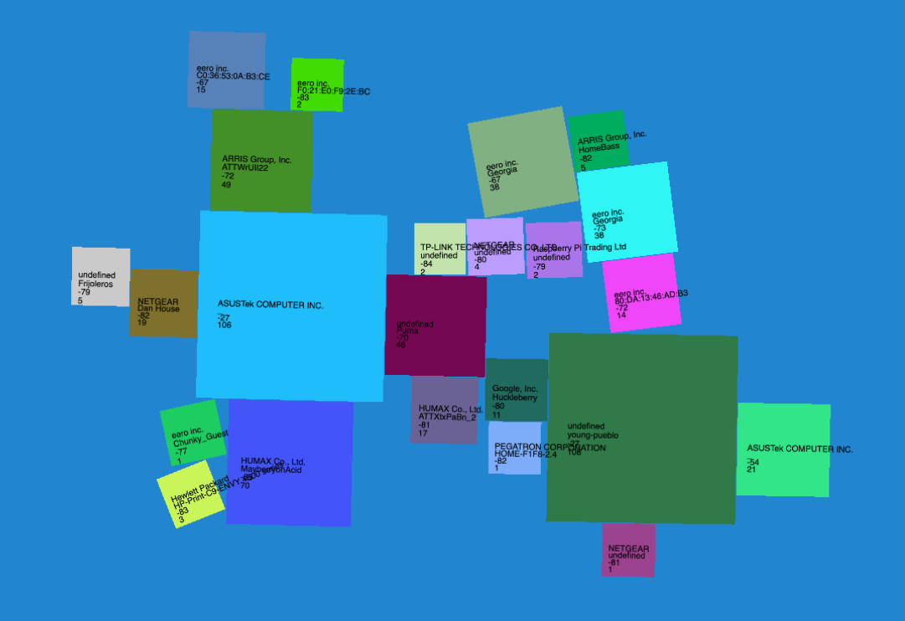

# Wifi Scanning "Game"

This is a "game" that uses Excalibur.js + Matter.js physics with airodump-ng data to visualize wifi signals all around us. The goal of the game is to find the hidden wifi devices and turn them off. :)

Ideally you run this on a raspnberry pi with a battery and an extra wifi device that supports monitor mode. Then you can walk around and visualize the different wifi signals.




[example mov](media/example.mov)

## How to Run

### For Local Testing with Prebuilt JS + data

```sh
cd dist && python3 -m http.server 8888
```

### For Real

```sh

sudo apt-get install -y aircrack-ng

# enable monitor mode on chosen wifi card into 
sudo airmon-ng start wlan1

# in dist/data file you will want to run
cd ./dist/data && chmod +x networkScan.sh && ./networkScan.sh

# then in dist folder you will want to run
cd ./dist && python3 -m http.server 8888

```


## Resources

Based off of code from 
https://github.com/excaliburjs/sample-matterjs
and
https://www.youtube.com/watch?v=ru1uo9k4v0s
